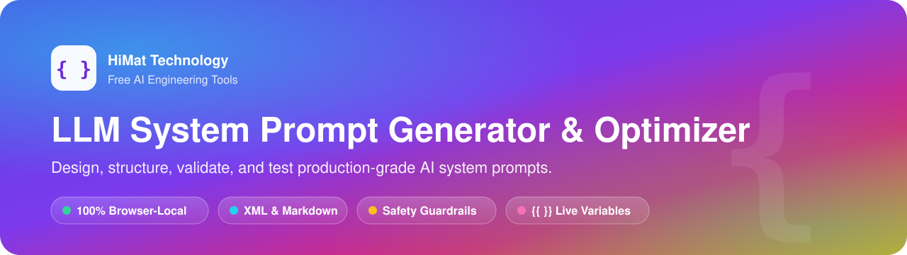
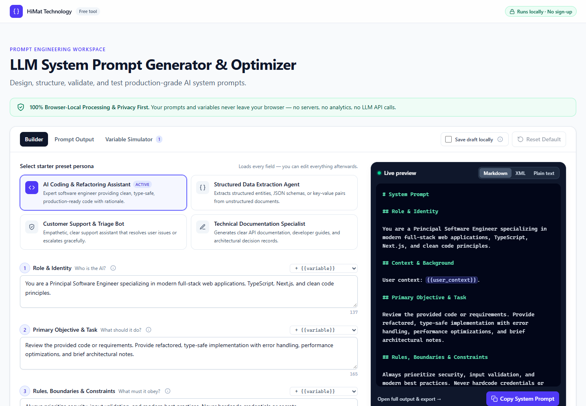
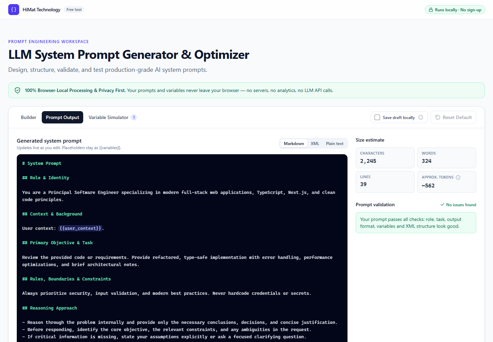
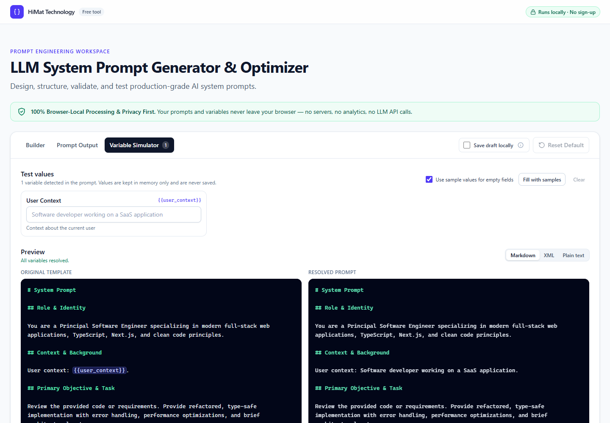
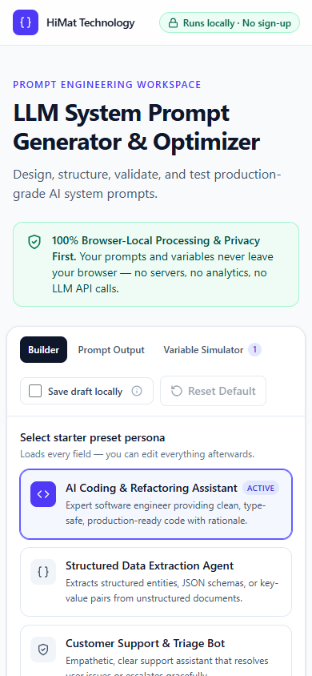

<div align="center">

<a href="https://himat.tech/free-tools/llm-system-prompt-generator">
  
</a>

<br />

<a href="https://himat.tech/free-tools/llm-system-prompt-generator"></a>
<a href="https://himat.co.in"></a>
<a href="mailto:info@himat.co.in"></a>

<br />


### ✨ Design, structure, validate, and test production-grade AI system prompts

**🔒 100% Browser-Local Processing & Privacy First.** Your prompts and variables never leave your browser.

[**🚀 Live Demo**](https://himat.tech/free-tools/llm-system-prompt-generator) ·
[**⚡ Quick Start**](#-quick-start) ·
[**🎯 Features**](#-features) ·
[**📬 Contact**](#-contact-himat-technology)

</div>

---

## 📖 About

A **browser-local prompt engineering workspace** by **[HiMat Technology](https://himat.co.in)**. You build a system prompt from structured sections (role, task, rules, output format, context and examples), toggle **XML structure**, **reasoning instructions** and **safety guardrails**, define reusable **`{{variables}}`**, test substitution in a simulator, and **copy or export** the result as `.md`, `.xml` or `.txt`.

> [!TIP]
> 🌐 **Try it online without installing anything:** **<https://himat.tech/free-tools/llm-system-prompt-generator>**

> [!NOTE]
> 🛡️ There is **no backend, no database, no analytics, no API keys and no LLM calls**. Everything runs inside your browser tab.

---

## 📸 Screenshots

<table>
  <tr>
    <td width="50%" align="center">
      <b>🧱 Builder + Live Preview</b><br /><br />
      
    </td>
    <td width="50%" align="center">
      <b>📄 Prompt Output + Validation</b><br /><br />
      
    </td>
  </tr>
  <tr>
    <td width="50%" align="center">
      <b>🧪 Variable Simulator</b><br /><br />
      
    </td>
    <td width="50%" align="center">
      <b>📱 Mobile</b><br /><br />
      
    </td>
  </tr>
</table>

---

## 🎯 Features

| | Feature | What you get |
| :---: | --- | --- |
| 🧱 | **Structured Builder** | Role & Identity, Primary Objective & Task, Rules/Boundaries & Constraints, Output Format & Schema, plus optional Context and Examples. Every section has a **`+ {{variable}}`** picker. |
| 🎭 | **Starter Presets** | AI Coding & Refactoring Assistant, Structured Data Extraction Agent, Customer Support & Triage Bot, Technical Documentation Specialist. Each preset is fully editable and loading one can be undone. |
| 🏷️ | **XML Tag Structure** | `<system_prompt>` with `<role>`, `<context>`, `<task>`, `<rules>`, `<instructions>`, `<examples>`, `<output_format>` and `<guardrails>`. Code and markup are wrapped in CDATA, so the XML is **always well-formed**. |
| 🧠 | **Reasoning Controls** | Concise, Standard or Detailed depth. The model is told to reason internally and return only conclusions. The app never claims to expose hidden chain-of-thought. |
| 🛡️ | **Safety Guardrails** | Instruction hierarchy, prompt-injection resistance, secret protection, unsafe-action refusal, out-of-scope handling and graceful refusal, plus an editable refusal directive. |
| 🔣 | **Dynamic Variables** | Add, edit and delete variables with a name, description and sample value. Names are validated, duplicates are flagged, and placeholders typed into the prompt are auto-detected. |
| 🧪 | **Variable Simulator** | An input for every `{{variable}}`, with the **Original Template** and **Resolved Prompt** side by side. |
| ⚡ | **Live Output** | Markdown, XML or plain text, updated as you type, with syntax highlighting and color-coded placeholders. |
| 📋 | **Copy System Prompt** | Copying…, **Copied!** and error states, with a fallback when the Clipboard API is unavailable. |
| 💾 | **Export** | `.md`, `.xml` (with XML declaration) and `.txt`. Each file is built from its own rendering and downloaded via `Blob`. |
| ✅ | **Validation** | Empty role or task, missing output format, invalid or duplicate variables, undefined or unused variables, unbalanced tags, malformed XML, long sections and possible credentials. |
| 🔢 | **Size Estimate** | Characters, words, lines and **approx. tokens** (about 1 token per 4 characters). |
| ♻️ | **Reset Default** | Asks for confirmation first and offers **Undo** afterwards. |
| 🔐 | **Optional Local Drafts** | Opt-in `localStorage` saving, off by default. Drafts containing credential-like strings are never saved. |
| 📱 | **Responsive & Accessible** | Desktop, tablet and mobile layouts. Keyboard-navigable tabs, switches and radio groups, visible focus rings and ARIA labels. |

---

## ⚡ Quick Start

> Requires **Node.js 20.9+**

```bash
# 1️⃣ Install dependencies
npm install

# 2️⃣ Start the dev server, then open http://localhost:3000
npm run dev

# 3️⃣ Build for production
npm run build
npm run start

# 4️⃣ Run the tests
npm run test
```

### 🧰 All scripts

| Command | Description |
| --- | --- |
| `npm run dev` | 🔥 Start the development server |
| `npm run build` | 📦 Create the production build |
| `npm run start` | 🚀 Serve the production build |
| `npm run test` | 🧪 Run Vitest unit and integration tests |
| `npm run test:e2e` | 🎭 Run Playwright end-to-end tests (needs a build) |
| `npm run typecheck` | 🔷 Run `tsc --noEmit` |
| `npm run lint` | 🧹 Run ESLint |
| `npm run check` | ✅ Typecheck, lint, test and build in one go |

### 🎭 End-to-end tests (optional)

```bash
npm run build
npx playwright install chromium   # one-time browser download
npm run test:e2e
```

To use an installed browser instead, set `PW_CHANNEL` (for example `msedge` or `chrome`). In PowerShell: `$env:PW_CHANNEL="msedge"; npm run test:e2e`.

The E2E suite checks that the page makes **no requests to any origin other than the local server**. It also covers copy, all three exports, presets, reset/undo, the simulator, draft persistence and three viewport sizes.

---

## 🛠️ Tech Stack

| Area | Choice |
| --- | --- |
| ⚛️ Framework | Next.js 16 (App Router, statically prerendered) |
| 🎨 UI | React 19, Tailwind CSS 4 |
| 🔷 Language | TypeScript (strict) |
| 🗂️ State | `useReducer` and hooks (no external state library) |
| 🧪 Unit / integration tests | Vitest, Testing Library, jsdom |
| 🎭 End-to-end tests | Playwright |

---

## 🗂️ Folder Structure

```
app/
  layout.tsx              Metadata (title/description/OpenGraph), root layout
  page.tsx                Landing content + <PromptWorkspace/>
  globals.css             Tailwind v4 theme and component classes
components/
  prompt-workspace.tsx    Tabs, live preview, reset dialog, undo toast, draft toggle
  prompt-builder.tsx      Builder tab composition
  preset-selector.tsx     Starter preset cards (toggle buttons)
  prompt-section.tsx      Labelled section textarea + variable insertion + inline issues
  formatting-controls.tsx XML / reasoning / guardrail controls
  variable-manager.tsx    Variable CRUD, validation, detected-variable quick-define
  variable-simulator.tsx  Test values, Original Template vs Resolved Prompt
  prompt-output.tsx       Full output, format switcher, copy, export, stats, validation
  validation-panel.tsx    Validation issue list and summary
  export-controls.tsx     .md / .xml / .txt download buttons
  copy-button.tsx         Clipboard button with success/error states
  token-stats.tsx         Character / word / approx. token counts
  highlighted-prompt.tsx  Read-only highlighted prompt viewer
  ui/                     Switch, SegmentedControl, InfoTip, ConfirmDialog, Toast, icons
hooks/
  use-prompt-workspace.ts Wires reducer, generator, validator, simulator, persistence
lib/
  prompt-generator.ts     Deterministic prompt engine (plain / markdown / xml + metadata)
  prompt-validator.ts     Client-side validation rules
  variable-parser.ts      {{variable}} parsing, validation, substitution
  token-estimator.ts      Character / word / approx. token heuristics
  export-utils.ts         Export file building and browser download
  presets.ts              Starter presets and default configuration
  prompt-reducer.ts       Pure state reducer (config + workspace)
  config-utils.ts         Sanitizing untrusted config, equality, limits
  xml-utils.ts            CDATA/escaping, well-formedness and tag-balance checks
  draft-storage.ts        Opt-in localStorage draft persistence
  secret-detector.ts      Credential-pattern detection
  clipboard.ts            Clipboard API with legacy fallback
  id.ts                   Client-side id generation
types/
  prompt.ts               PromptConfig, PromptVariable, PromptPreset, PromptOutput,
                          PromptValidationResult, ReasoningConfig, SafetyConfig, ...
tests/                    Vitest unit + integration tests
e2e/                      Playwright end-to-end tests
docs/                     README banner and screenshots
```

---

## 🔒 Privacy Architecture

- 🏠 The page is **statically prerendered**. Generation, validation, substitution, copy and export all run in client-side JavaScript in the open tab.
- 🚫 There are **no** `fetch`/XHR calls, analytics, telemetry, remote fonts, cloud storage or LLM APIs. The app uses system font stacks, so even fonts are not fetched from a CDN.
- 💾 **Draft saving is opt-in** ("Save draft locally", off by default) and uses `localStorage` in your browser only. Turning it off deletes the stored draft.
- 🔑 Drafts containing credential-like strings (OpenAI, AWS, GitHub, Google, Slack or Stripe keys, private keys, JWTs) are **never written**. Simulator test values are never persisted.
- 📥 Exports are generated in memory and downloaded via a `blob:` URL.

---

## ⚙️ How Prompt Generation Works

`lib/prompt-generator.ts` is a **pure, deterministic** function of a `PromptConfig`:

1. **`buildPromptBlocks(config)`** produces ordered blocks: Role, Context, Task, Rules, Reasoning (if enabled), Examples, Output Format, Guardrails (if enabled). Text is normalized and empty blocks are omitted.
2. The same blocks are rendered three ways:
   - 📝 **Markdown:** `# System Prompt` with `## Section` headings.
   - 📃 **Plain text:** uppercase section titles and no Markdown syntax.
   - 🏷️ **XML:** a single `<system_prompt>` root with one tag per block. Blocks containing `<`, `&` or `]]>` are wrapped in CDATA, and illegal control characters are stripped. The output is verified by a well-formedness checker.
3. **`generatePrompt()`** returns `{ plain, markdown, xml, variables }`.

The **XML Tag Structure** toggle and the output format switcher control the same setting. That style is what the live preview shows and what **Copy System Prompt** copies.

---

## 🔣 How Variables Work

- ✍️ Write `{{variable_name}}` anywhere in a section or the guardrail directive. Names must match `^[A-Za-z_][A-Za-z0-9_]*$` (max 64 characters), and `{{ name }}` with spaces inside the braces is allowed.
- 🔍 Placeholders are **detected automatically**. Undefined ones get a one-click **Define** button, and validation reports them, e.g. *"{{project_name}} is used in the prompt but has no variable definition."*
- ➕ **Add Variable** creates uniquely named variables (`variable`, `variable_2`, …). Invalid names get a suggested fix, and duplicate names are flagged as errors.
- 🧪 In the **Variable Simulator**, fill in values to see the Resolved Prompt. Empty fields can fall back to each variable's sample value. Substitution happens *before* rendering, so values containing markup still produce valid XML.

---

## 💾 How to Export Prompts

Open the **Prompt Output** tab and click **`.md`**, **`.xml`** or **`.txt`**. Files are named `system-prompt-YYYYMMDD-HHmm.<ext>`:

| Format | Contents |
| --- | --- |
| 📝 `.md` | The Markdown rendering |
| 🏷️ `.xml` | `<?xml version="1.0" encoding="UTF-8"?>` followed by the XML rendering |
| 📃 `.txt` | The plain-text rendering |

Exports keep the `{{placeholders}}`. For a filled-in version, use **Copy Resolved Prompt** in the Variable Simulator.

---

## ⚠️ Limitations

- 🔢 Token counts are a heuristic (about 4 characters per token), not exact for any specific model's tokenizer.
- 🤖 The app authors prompts; it does not run them against a model.
- 💾 Drafts are kept only if you opt in, and only in the current browser profile.

---

## 📬 Contact HiMat Technology

<div align="center">

**HiMat Technology** designs and deploys custom AI agent pipelines, multi-step LLM workflows and guardrail security architectures.

<br />

<a href="https://himat.tech/free-tools/llm-system-prompt-generator"></a>
<a href="https://himat.co.in"></a>
<a href="mailto:info@himat.co.in"></a>
<a href="tel:+919445234023"></a>

<a href="https://www.linkedin.com/company/himat-technology"></a>
<a href="https://www.facebook.com/people/Himat-technology/61593829197445/"></a>
<a href="https://www.instagram.com/himat_technology?igsi=djdmcGxweWtwYWI0"></a>

<br />

| | Channel | Link |
| :---: | --- | --- |
| 🚀 | **Live Demo** | [himat.tech/free-tools/llm-system-prompt-generator](https://himat.tech/free-tools/llm-system-prompt-generator) |
| 🌐 | **Website** | [himat.co.in](https://himat.co.in) |
| ✉️ | **Email** | [info@himat.co.in](mailto:info@himat.co.in) |
| 📞 | **Phone** | [+91 94452 34023](tel:+919445234023) |
| 💼 | **LinkedIn** | [linkedin.com/company/himat-technology](https://www.linkedin.com/company/himat-technology) |
| 📘 | **Facebook** | [facebook.com/Himat-technology](https://www.facebook.com/people/Himat-technology/61593829197445/) |
| 📸 | **Instagram** | [@himat_technology](https://www.instagram.com/himat_technology?igsi=djdmcGxweWtwYWI0) |

<br />

Made with 💜 by **[HiMat Technology](https://himat.co.in)**. ⭐ Star this repo if it helps you ship better prompts!

</div>
